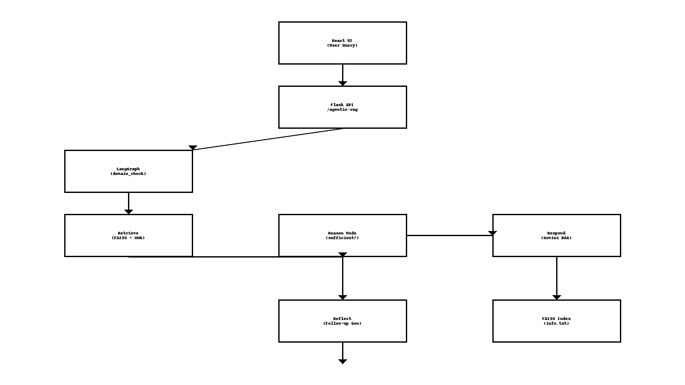

# Agentic RAG with LangGraph, Gemini, and FAISS  

This project implements a fully working **Agentic Retrieval-Augmented Generation (RAG)** system using:

- LangGraph for multi-step agent workflows  
- Gemini 2.x Flash for LLM reasoning + strict grounding  
- FAISS for fast local semantic search  
- SQLite for persistent chat memory  
- React + Vite for a clean UI with suggested follow-up questions  
- Domain guardrails to prevent out-of-scope answers  


---

## 📊 Architecture Diagram



The Mermaid source is available here:  
**[architecture.mmd](architecture.mmd)**

---

## 📁 Folder Structure

```
agentic-rag-langgraph/
├── agentic-rag-ui/                 # React frontend
│   ├── src/
│   ├── package.json
│   └── ...
│
├── langgraph-server/               # Python backend (Flask + LangGraph)
│   ├── app.py
│   ├── routes/
│   │   └── rag_routes.py
│   ├── core/
│   │   └── langgraph_runner.py
│   ├── data/
│   │   └── info.txt                # Knowledge base for FAISS
│   ├── faiss_index/                # Auto-generated vector index
│   │   ├── index.faiss
│   │   └── index.pkl
│   ├── utils/
│   │   └── cosine_similarity.py
│   ├── build_vectorstore.py        # Builds vector store from info.txt
│   ├── document_loader.py
│   ├── memory.db                   # SQLite chat history
│   ├── requirements.txt
│   └── .env
│
├── anim.html                       # LangGraph execution animation
├── diagram.html                    # Architecture diagram
└── README.md
```

---

## ⚙️ Backend Setup (Flask + LangGraph)

### 1. Build the FAISS Vector Store

```bash
cd langgraph-server
python build_vectorstore.py
```

---

### 2. Create and activate a virtual environment

```bash
python -m venv venv
venv\Scripts\activate        # Windows
# or
source venv/bin/activate       # macOS/Linux
```

---

### 3. Install dependencies

```bash
pip install -r requirements.txt
```

---

### 4. Add your Gemini API key

Create:

```
langgraph-server/.env
```

Inside:

```
GEMINI_API_KEY=your_key_here
```

---

### 5. Start the backend

```bash
python app.py
```

Runs at:

```
http://localhost:5000
```

---

## 🖥 Frontend Setup (React + Vite)

```bash
cd agentic-rag-ui
npm install
npm run dev
```

Runs at:

```
http://localhost:5173
```

---

## 🧠 LangGraph Agent Workflow

```
User Query
      ↓
domain_check
      ↓
retrieve
      ↓
reason
      ├── sufficient → respond
      └── insufficient → retrieve_again → respond
      ↓
reflect
      ↓
Return JSON → React UI → stored in SQLite
```

---

## 🔍 Features

- Semantic retrieval (FAISS)  
- Multi-hop retrieval  
- Domain guardrails  
- Strict grounding (no hallucinations)  
- Follow-up question generation  
- Persistent conversation memory  
- React UI with markdown  
- Reset session + chat history API  

---

